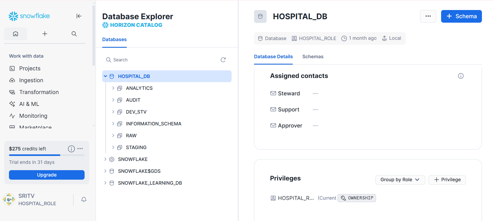
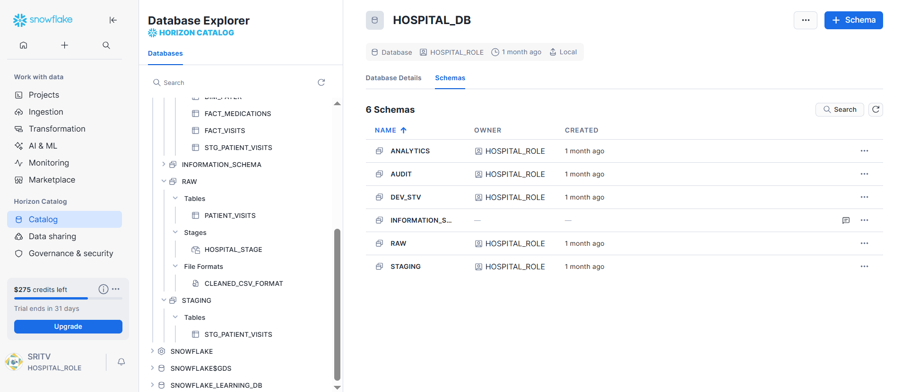
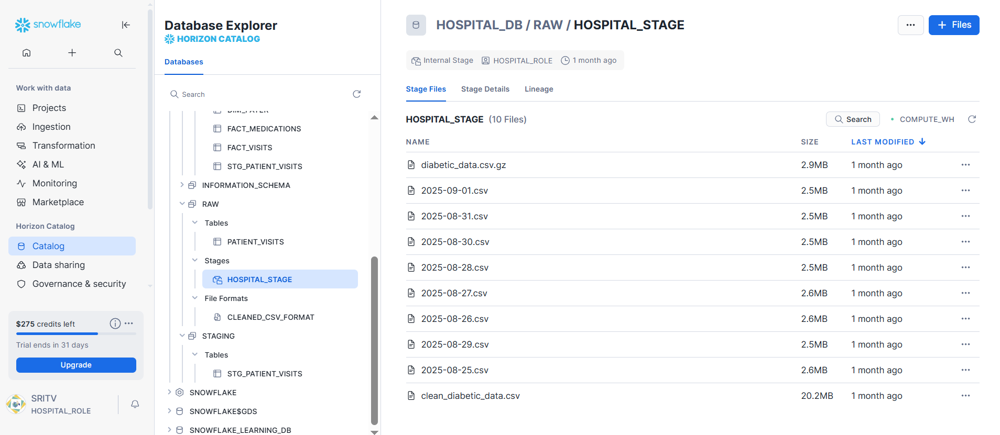
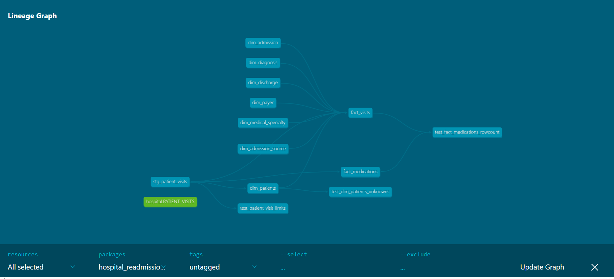
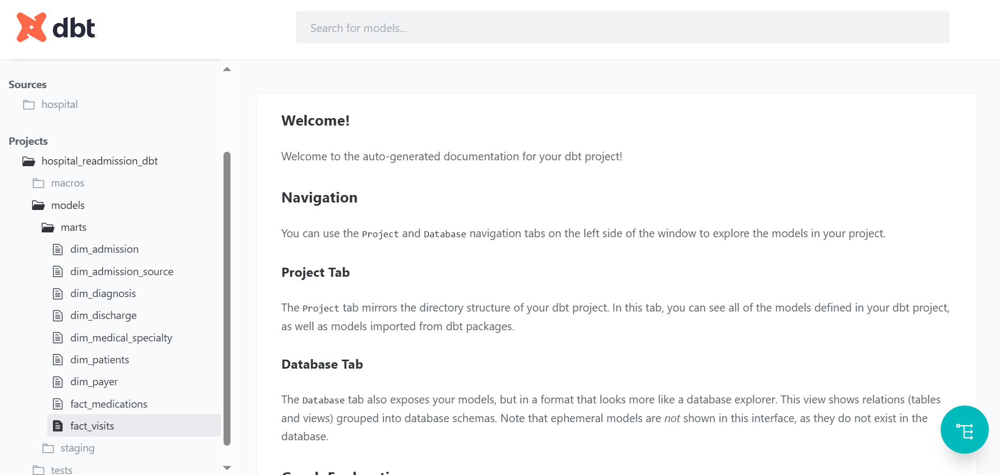

# 🏥 Hospital Readmission Analytics Pipeline

This project designs an **end-to-end data engineering + analytics pipeline** to study hospital readmissions.  
It ingests raw patient data into Snowflake, transforms it into a clean star schema with dbt, orchestrates with Airflow, and powers BI dashboards to identify readmission risk factors.

---

## 🎯 Goals
- Automate ingestion → Snowflake  
- Transform into clean star schema → dbt  
- Orchestrate daily refresh → Airflow  
- Visualize KPIs → Power BI  
- Document & share results → GitHub  

---

## ⚙️ Tech Stack
- **Storage & Processing:** Snowflake (RAW → STAGING → ANALYTICS)  
- **Transformations:** dbt-core (Snowflake adapter)  
- **Orchestration:** Apache Airflow (Astronomer)  
- **BI / Dashboards:** Power BI  
- **Scripting:** Python + Snowflake Connector  
- **Version Control:** GitHub  

---

## 📂 Repository Structure
Hospital_Readmission_Analytics/
├── python_scripts/ # Cleaning + Modeling notebooks
├── snowflake/ # Setup & ingestion SQL
├── documentation/ # Phase-wise notes & lessons learned
├── dashboards/ # Power BI dashboard
├── data/ # Raw & cleaned CSVs
├── diagrams/ # ERD, pipeline, Snowflake & dbt screenshots
└── references/ # Original project plan & notes

yaml
Copy code

---

## 🔗 Related Repositories
- **dbt Models:** [Hospital_Readmission_dbt](https://github.com/srilekhatv/Hospital_Readmission_dbt)  
- **Airflow Orchestration:** [Hospital_Readmission_AirflowOrchestration](https://github.com/srilekhatv/Hospital_Readmission_AirflowOrchestration)  

---

## 🗄️ Snowflake Setup (Screenshots)

**Database & Schemas**

**RAW, STAGING, ANALYTICS**

**Stage & File Format**

**Analytics Layer**

---

## 📊 dbt Transformations (Screenshots)

**Lineage Graph**

**Model Documentation**

---

## 📈 Dashboard Preview

**Power BI Executive Summary**

KPIs:  
- Readmission rate by diagnosis, age, admission type  
- Avg stay duration (readmitted vs not)  
- Patient volume trends  
- Common diagnoses for readmission  

---

## 🚀 Results
- ~102,000 hospital encounters processed  
- **Star schema** created: `dim_patients`, `dim_diagnosis`, `dim_admission`, `fact_visits`  
- dbt lineage graph & docs for transparency  
- Automated daily pipeline with Airflow DAG  
- Dashboard surfaced KPIs for hospital leadership  

---

## 📌 Lessons Learned
- **Snowflake Privileges:** Required schema ownership for dbt builds  
- **dbt Tests:** Allowed WARNs for >5% Unknown categories  
- **Airflow DAG:** Fixed execution_date bug, upgraded Snowflake provider  
- **Modeling:** Chose XGBoost (tuned + weighted, reduced features) as the best model (~0.687 AUC)  
- **Explainability:** SHAP + EBM explained drivers like discharge disposition, age, and diagnoses  
- **Data Quality Philosophy:** Kept “Unknown” categories visible to highlight upstream data gaps  

---

## 👩‍⚕️ Business Value
- Identifies **patients at high risk of 30-day readmission**  
- Highlights **critical diagnoses** (circulatory, diabetes)  
- Enables hospitals to **target interventions** and reduce costs  
- Surfaces **data quality issues** (Unknown payer codes, specialties, labs) for operational improvement  

---

✨ This repo serves as the **master showcase** (docs, diagrams, dashboards).  
For transformations and orchestration, see linked dbt & Airflow repos.