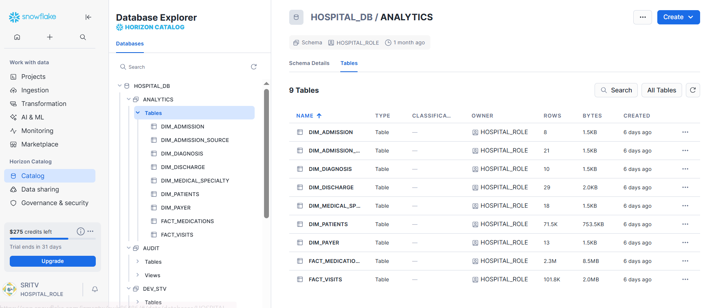

# 🏥 Hospital Readmission Analytics Pipeline

This project designs an **end-to-end data engineering + analytics pipeline** to study hospital readmissions.  
It ingests raw patient data into Snowflake, transforms it into a clean star schema with dbt, orchestrates with Airflow, and powers BI dashboards to identify readmission risk factors.

---

## 🔎 Executive Summary

Hospital readmissions are a critical challenge for healthcare providers, driving up costs and impacting patient outcomes.  
This project builds a **modern data pipeline** that ingests raw hospital visit records into Snowflake, transforms them with dbt, automates refreshes with Airflow, and delivers **Power BI dashboards** for hospital leadership.  

On top of the pipeline, we developed predictive models to identify patients at high risk of 30-day readmission.  
The solution combines **data engineering, analytics, and machine learning** in a single portfolio project, showing how modern data stack tools can deliver both **operational efficiency** and **business insights**.

---

## 🎯 Goals
- Automate ingestion → Snowflake  
- Transform into clean star schema → dbt  
- Orchestrate daily refresh → Airflow  
- Visualize KPIs → Power BI  
- Document & share results → GitHub  

---

## ⚙️ Tech Stack
- **Storage & Processing:** Snowflake (RAW → STAGING → ANALYTICS)  
- **Transformations:** dbt-core (Snowflake adapter)  
- **Orchestration:** Apache Airflow (Astronomer)  
- **BI / Dashboards:** Power BI  
- **Scripting:** Python + Snowflake Connector  
- **Version Control:** GitHub  

---

## 📂 Repository Structure

"```"
Hospital_Readmission_Analytics/
├── python_scripts/     # Cleaning + Modeling notebooks
├── snowflake/          # Setup & ingestion SQL
├── documentation/      # Phase-wise notes & lessons learned
├── dashboards/         # Power BI dashboard
├── data/               # Raw & cleaned CSVs
├── diagrams/           # ERD, pipeline, Snowflake & dbt screenshots
└── references/         # Original project plan & notes
"```"


yaml
Copy code

---

## 🔗 Related Repositories
- **dbt Models:** [Hospital_Readmission_dbt](https://github.com/srilekhatv/Hospital_Readmission_dbt)  
- **Airflow Orchestration:** [Hospital_Readmission_AirflowOrchestration](https://github.com/srilekhatv/Hospital_Readmission_AirflowOrchestration)  

---

## 🗄️ Snowflake Setup (Screenshots)

**Database & Schemas**


**RAW, STAGING, ANALYTICS**


**Stage & File Format**


**Analytics Layer**


---

## 📊 dbt Transformations (Screenshots)

**Lineage Graph**


**Model Documentation**


---

## 📈 Dashboard Preview

**Power BI Executive Summary**


KPIs:  
- Readmission rate by diagnosis, age, admission type  
- Avg stay duration (readmitted vs not)  
- Patient volume trends  
- Common diagnoses for readmission  

---

## 📊 Predictive Modeling Summary

In addition to pipeline engineering, we trained machine learning models on the transformed dataset (~102K encounters).  
Our goal: predict whether a patient would be **readmitted within 30 days**.

- **Baseline models** (Logistic Regression, Random Forest) were weak (AUC ~0.55).  
- **Enriched dataset** with diagnoses, labs, and medications improved Logistic Regression to AUC ~0.67.  
- **Best model:**  
  - **XGBoost (reduced features, class weighting, hyperparameter tuning)**  
  - **ROC-AUC ~0.687** on the test set  
  - **Recall prioritized** over precision → aligned with healthcare need to flag as many at-risk patients as possible.  
- **Explainability with SHAP & EBM** confirmed key drivers: discharge disposition, age group, diagnosis categories, number of medications.  

⚡ **Key takeaway:** While multiple boosting models (LightGBM, CatBoost) performed similarly, **tuned XGBoost offered the best balance of accuracy and clinical interpretability**.

---

## 🚀 Results

- **Data Pipeline:** Successfully ingested and processed ~102,000 hospital encounters into Snowflake.  
- **Data Modeling:** Designed a robust **star schema** (`fact_visits`, `dim_patients`, `dim_diagnosis`, `dim_admission`) to power analytics.  
- **Transformations:** dbt lineage graph and documentation provided full transparency and governance across 10+ models and 40+ tests.  
- **Orchestration:** Automated daily refresh with Airflow DAGs ensured reproducibility and near real-time insights.  
- **Predictive Modeling:**  
  - Best model → **XGBoost (reduced features, weighted, hyperparameter tuned)**  
  - Achieved **ROC-AUC ~0.687**, with recall prioritized to catch more high-risk patients.  
- **Dashboards:** Delivered **Power BI executive dashboard** for hospital leadership, surfacing:  
  - Readmission rates by diagnosis, age, and admission type  
  - Average stay duration (readmitted vs non-readmitted)  
  - Patient volume trends over time  
  - Top diagnoses linked to frequent readmissions  

⚡ **Impact:** This pipeline demonstrates how modern data engineering + ML workflows can help hospitals **reduce readmission costs, improve patient care, and highlight data quality gaps**.


---

## 📌 Lessons Learned
- **Snowflake Privileges:** Required schema ownership for dbt builds  
- **dbt Tests:** Allowed WARNs for >5% Unknown categories  
- **Airflow DAG:** Fixed execution_date bug, upgraded Snowflake provider  
- **Modeling:** Chose XGBoost (tuned + weighted, reduced features) as the best model (~0.687 AUC)  
- **Explainability:** SHAP + EBM explained drivers like discharge disposition, age, and diagnoses  
- **Data Quality Philosophy:** Kept “Unknown” categories visible to highlight upstream data gaps  

---

## 👩‍⚕️ Business Value
- Identifies **patients at high risk of 30-day readmission**  
- Highlights **critical diagnoses** (circulatory, diabetes)  
- Enables hospitals to **target interventions** and reduce costs  
- Surfaces **data quality issues** (Unknown payer codes, specialties, labs) for operational improvement  

---

✨ This repo serves as the **master showcase** (docs, diagrams, dashboards).  
For transformations and orchestration, see linked dbt & Airflow repos.